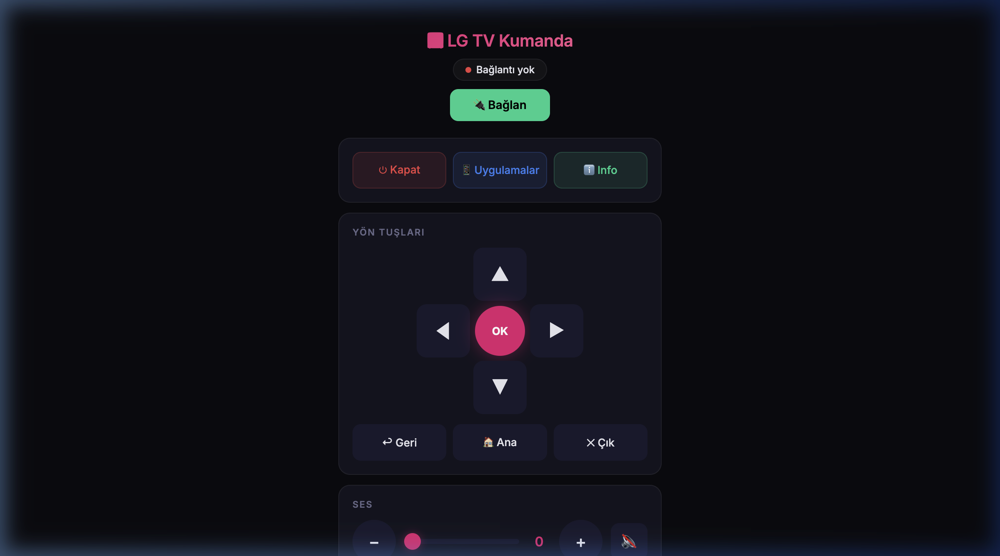

# WebOS Magic Caster & Remote

[](./LICENSE.md)
[](https://nodejs.org/)
[](https://github.com/ummugulsunn/webos-magic-caster/actions/workflows/ci.yml)

<p align="center">
  <b>A powerful, zero-crash Node.js remote control & video caster for LG WebOS Smart TVs.</b><br>
  <i>Perfectly bypasses WebOS 3.x (Chrome 38) browser memory limits and crashes by casting raw video links and SRT/VTT subtitles directly to the TV's native hardware player and a custom HTML5 proxy.</i>
</p>

<p align="center">
  
</p>

## Contents

- [Overview](#overview)
- [Features](#features)
- [Setup & installation](#setup--installation)
- [Configuration](#configuration)
- [Stremio / TorrServer workflow](#the-stremio--torrserver-workflow)
- [Troubleshooting](#troubleshooting)
- [GitHub topics (SEO)](#github-topics-seo)
- [Contributing & security](#contributing--security)
- [Türkçe açıklama](#türkçe-açıklama)

## Overview

Older LG Smart TVs typically suffer from severe RAM limitations and an outdated Chrome 38 browser engine. Watching modern streaming sites (like Stremio Web or pop-up heavy movie sites) often crashes the TV with "Out of Memory" errors.

This project mitigates that by running a lightweight Node.js server on your Mac/PC as a control hub. You find the stream on your device, paste the URL into the app, and it plays on the TV’s native player—without relying on the TV browser for heavy pages.

## Features

- **Native direct-play casting:** Send `.mp4`, `.m3u8` (HLS), or TorrServer streams to the WebOS hardware-accelerated media player.
- **Subtitle proxy player:** A lightweight HTML5 path that merges video with external `.srt`/`.vtt` subtitles on the fly (including SRT timestamp handling and common raw URLs).
- **Magic touchpad:** Move the TV cursor from phone or desktop (drag, tap, two-finger scroll).
- **Remote keyboard:** Send text to TV input fields (e.g. YouTube, browser).
- **App launcher:** List and launch installed WebOS apps.
- **Bilingual UI:** English and Turkish.

## Setup & installation

### Prerequisites

- **Node.js** 18 or newer.
- TV and computer on the **same Wi‑Fi** (or same LAN).
- **LG Connect Apps** enabled on the TV (network settings).

### Install and run

```bash
git clone https://github.com/ummugulsunn/webos-magic-caster.git
cd webos-magic-caster
npm install
npm start
```

The UI is available at `http://<your-computer-ip>:3333` (see console output). Pair the TV when prompted and accept on the TV with the physical remote. Pairing data is stored locally in `tv-key.json` (do not commit it).

## Configuration

| Variable | Default | Description |
| -------- | ------- | ----------- |
| `TV_IP` | `192.168.1.148` | Your LG TV’s IP on the LAN. Set to match your network, e.g. `TV_IP=192.168.1.50 npm start`. |
| `PORT` | `3333` | HTTP port for the web UI, e.g. `PORT=4000 npm start`. |

Example:

```bash
TV_IP=192.168.1.50 PORT=3333 npm start
```

## The "Stremio / TorrServer" workflow

1. Open **Stremio** or **TorrServer** on your PC/Mac and start playback.
2. Copy the **direct** stream URL (e.g. `http://.../stream.mp4` or HLS).
3. In this app’s UI, open **Direct Movie Play (w/ Subtitles)**.
4. Paste the video URL; optionally paste a `.srt` or `.vtt` URL.
5. Click **Play Movie** — playback should start on the TV’s native player.

## Troubleshooting

- **Cannot connect / pairing:** Confirm `TV_IP`, same subnet, firewall allows outbound to the TV, and **LG Connect Apps** is on. Accept the pairing dialog on the TV.
- **Wrong network interface:** If the UI shows the wrong LAN IP, check which interface is active (VPNs can interfere); the server picks the first non-internal IPv4 address.
- **Stream does not play:** Try a direct file/HLS URL the TV can reach; some hosts block non-browser clients or require HTTPS—test the URL from another device on the LAN.
- **Repository size:** This project uses `npm install` locally; do **not** commit `node_modules`. Only `package-lock.json` should be versioned.

## GitHub topics (SEO)

Adding [topics](https://docs.github.com/en/repositories/managing-your-repositorys-settings/classifying-your-repository-with-topics) on the repo helps people discover the project. Suggested tags:

`webos`, `lg-tv`, `smart-tv`, `remote-control`, `nodejs`, `stremio`, `torrserver`, `hls`, `m3u8`, `casting`, `subtitles`, `home-theater`, `opensource`

## Contributing & security

- [CONTRIBUTING.md](./CONTRIBUTING.md) — how to propose changes.
- [SECURITY.md](./SECURITY.md) — reporting vulnerabilities; this tool is for **private LANs**, not public exposure without extra hardening.

---

## Türkçe açıklama

Bu proje, eski LG TV’lerin (özellikle WebOS 3.x) Chrome 38 tarayıcısındaki “yetersiz bellek” çökmelerini ve ağır sitelerin donmasını azaltmak için geliştirilmiştir.

**Nasıl çalışır?** Filmi bilgisayarınızda (Stremio veya TorrServer) bulursunuz; video linkini (`m3u8`/`mp4`) ve isteğe bağlı altyazı linkini (`.srt`/`.vtt`) uygulamaya yapıştırırsınız. Oynatma, TV’nin donanım oynatıcısında veya projedeki hafif HTML5 proxy yoluyla yapılır.

Ayrıca D-pad, dokunmatik fare (touchpad), klavye ve uygulama başlatıcı ile TV’yi uzaktan yönetebilirsiniz.

---

*Open-source, for people tired of smart TV browser limits.*
